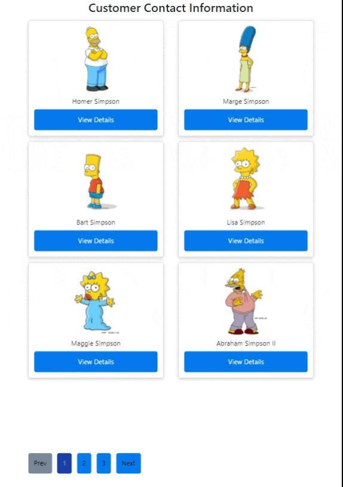

# Customer Contacts KN App

## This project has following folders
- contacts-ui: ReactJS application for frontend
    - Responsive and elegant UI
    - Dynamic data loading
    - Rest API connectivity
    - Pagination
    - Error handling
- rest_api: customer-contacts rest api for backend
    - Spring boot REST service
    - Customizable and scalable microservice standards
    - Easy pluggable app with any data source like nosql, RDBMS, file-system etc
    - Error handling
    - Meaningful beans and code
    - Extendable interfaces
- question
- demo
    - output demo

## Highlights

- Desktop with proper grid structure and pagination
 
In desktop there will be 4 columns and 3 rows = maximum 12 items per page and pagination will also work accordingly.

- iPad/Tab with proper grid structure and pagination
 
In iPad there will be 2 columns and 3 rows = maximum 6 items per page and pagination will also work accordingly.

- Mobile with proper grid structure and pagination
 
In iPad there will be 1 columns and 2 rows = maximum 2 items per page and pagination will also work accordingly.

- Network API calls
 
This is a working full-stack application where UI is making REST calls to back-end and getting stored data in JSON format to render back.
Below is the screen captured from chrome/network tab and GET call made through browser

